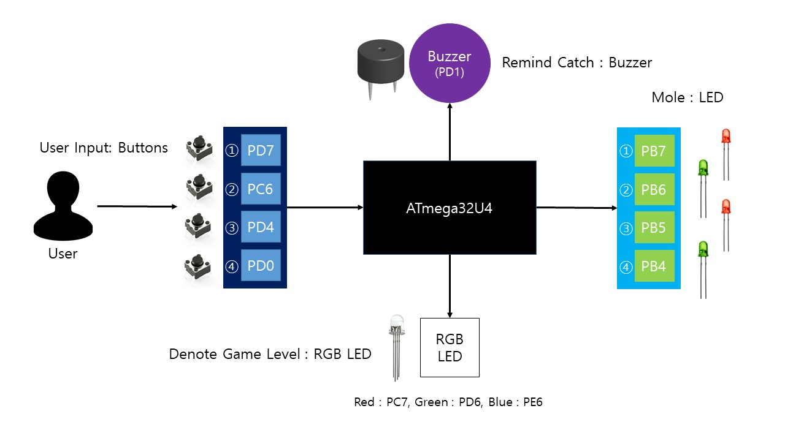
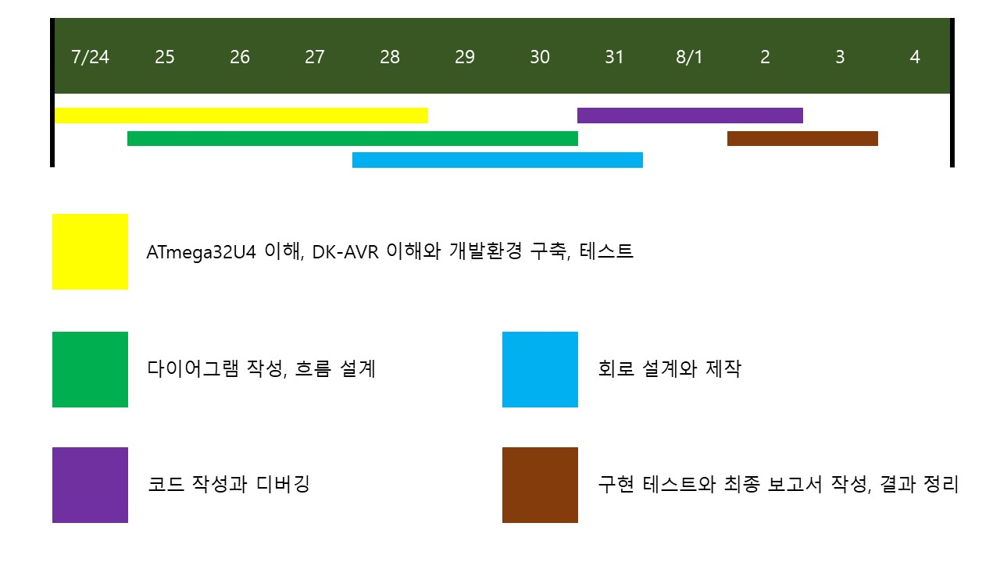
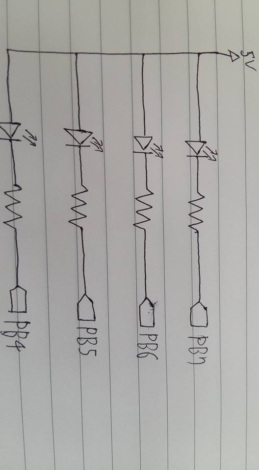
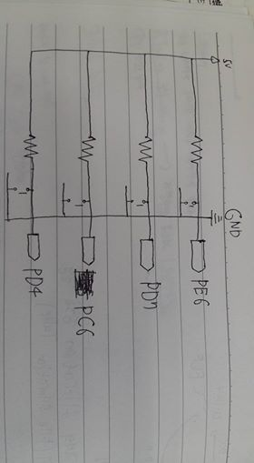

# Mole Project - DK-AVR을 활용한 두더지 잡기 게임

## Block Diagram

## 동작 설명
다이어그램과 같이, 모든 LED와 버튼에 번호 부여

n번 LED가 점등중일 때 n번 버튼을 누르면, 0.2초 간격으로 두 번 깜빡이고 소등,  
동시에 부저가 0.2초간 소리 출력

깜빡이는 중에는 해당 LED가 새로운 두더지로 점등되지 않도록 함

LED 점등 시간 : 기본 3초, 단계가 오를 때마다 0.4초씩 감소

점등 시간 안에 해당하는 버튼을 누르지 못했을 경우 소등

새로운 LED의 점등 간격은, LED의 점등 시간과 동일

위의 상황으로 LED가 15번 소등되었을 경우 모든 LED 점등 – 게임오버를 나타냄

================================

단계 표시 : 파랑 - 초록 - 노랑 - 빨강

시간에 관계 없이, 20마리 잡으면 단계 상승

## Time Table

## 회로 구성
### Schematic - LEDs Part

### Schematic - Buttons Part

